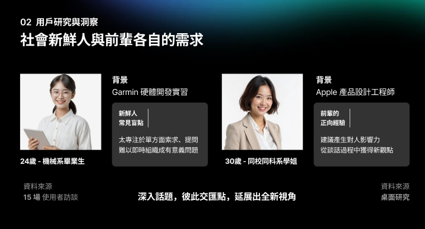

# Expressoul-Coffee-Chat
About OpenHCI 2025 – Team 3 XRAI: 利用現有AI技術為工具，透過XR互動方式作為媒介，探索未來互動方式

我們這組利用 Meta Quest Pro 配合 Unity 所搭建的 UI/UX ，來時現在現實世界中呈現虛擬的介面來做互動。

## Theme Discussion

我們的專案想要是以一個剛步入社會找工作的新鮮人出發，這個人可能是透過某個人某個事情（keyrelation）來跟前輩或是主管創造一小部分的overlapping 的部分，而我們不想要是以產品角度出發，是以改善整個對談流程的系統中扮演agent代理人輔助，不過度干涉使用者。

因為我們透過先前的訪問知道大家在這個coffee chat中的最大問題是，焦慮常常就會沒話題或是讓整體對談變成目標導向，但我們應該反過來思考，也要思考對方的角度，創造我們雙方的印象impression，然後再對談的一開始就是要以提升或昇華雙方的overlapping 未知處去創造未來繼續交流的可能性！

## Related_work

## User Persona

## Engineering 

Input有雙方的背景資料與談話目標、對話音檔、以及使用者的選擇回饋。

這三筆inputs會經由Unity中的client端，發送這兩筆資料到外部server。

我們將Gemini API與server串接，根據所有input information，利用LLM判斷使用者可能較有興趣的話題與提示，其中Gemini使用到兩個版本模型，2.5_Pro應用在找共同點，而對話語音或元件更新，則選用快速的Flash。

由Gemini輸出語句提示整理後，我們再回過頭提取關鍵詞句顯示在Unity UI上。

## Demo

